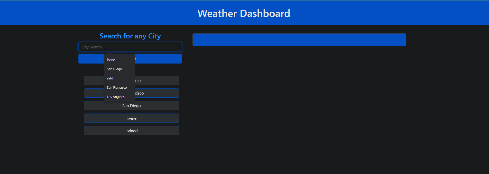
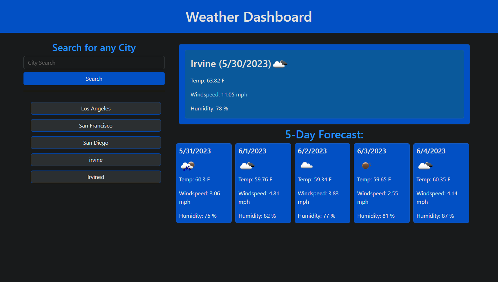

# Weather Dashboard

## Description

The Weather Dashboard project aims to provide users with current weather information and a five-day forecast. The motivation behind this project is to create a user-friendly dashboard that retrieves weather data by utilizing the OpenWeatherMap API.

## Usage

Access the webpage at [Weather Dashboard](https://lapuzshawn.github.io/Weather-Dashboard/). 

1. Type in an any city in the input box uder "Search"
2. View the Weather for today and 5-day forecast
3. (Optional, if the weather is good then travel to that destination)

Note: searching for a city outside Earth (like Mars) will return an error 

## Screenshots

